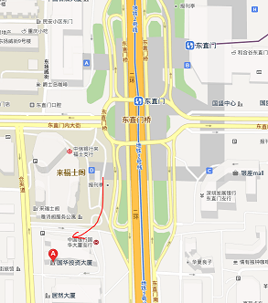
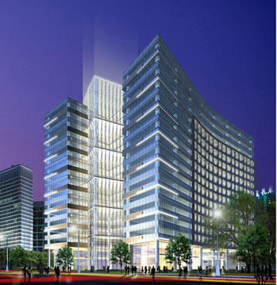
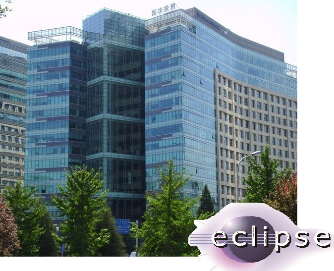
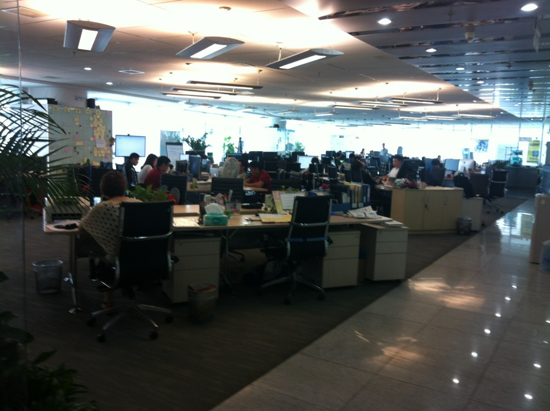
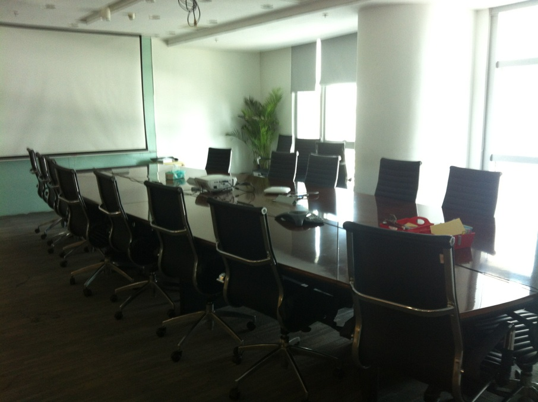
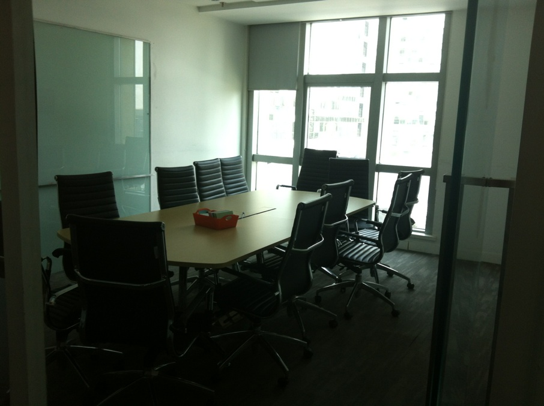

## Location 场地

ThoughtWorks Beijing office

ThoughtWorks, Rm 1105 Guohua Plaza, No.3 Dongzhimen South St, Dongcheng District, Beijing (DongZhiMen Subway station, exit D)

北京市东城区东直门南大街3号国华投资大厦1105室ThoughtWorks （地铁东直门站D口） 

### Photos 照片

Big Room - Main track - East Palace

Small Room - Second track - Han

Hackathon - Qin

### About ToughtWorks

We are a software company and a community of passionate, purpose-led individuals. We think disruptively to deliver technology to address our clients' toughest challenges, all while seeking to revolutionize the IT industry and create positive social change.

Wherever we are in the world, ThoughtWorkers share the same cultural characteristics and imperatives. We come to work as ourselves. We enjoy each other’s company. We value honesty and transparency. Appearances and backgrounds aren’t important to us; ideas and doing the right thing are. We abhor and reject discrimination and inequality and promote diversity in all its forms. We proudly, passionately and actively strive to make both ThoughtWorks and our industry more reflective and inclusive of the society that we serve.
