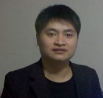

<b>Back to <a href="/Day/">Day page</a> | 回<a href="/Day/">Day网页</a></b>

See also [materials](../materials).

## Speakers

*2. 
Jianfeng Liu  
eBay Engineering Consultants Ltd  
Shanghai City, China  

*4.   
Manuel Bork  
Product Manager bei Yatta Solutions GmbH  

*5.   
Rabea Gransberger  
Software Engineer bei MEKO-S GmbH  

*6.   
Jin Mingjian  
Technical Staff at Oracle Research and Development Center - Beijing  

*7.   
Thomas Schuetz  
Protos Software GmbH, CEO  
Munich Area, Germany  

*8.   
Andreas Graf  
BDM Automotive at itemis  
Germany  

*9.   
Karsten Thoms  
Software Architect at itemis AG  
Essen Area, Germany  

*10.   
Anton Arhipov    
JRebel Product Manager at ZeroTurnaround    
Estonia  

*11.     
Matthias Zimmermann  
Eclipse Scout Co-Lead  

*12.     
杨光福  
Funshion Online 风行网  

*13. 
Liu Wu
Talend China

*14.   
Giampiero Granatella  
Software Architect at ManyDesigns  
Genoa Area, Italy  

*18.   
Ekkehard Gentz  
BlackBerry Elite Member: International Development Mobile Apps BlackBerry 10 - Cascades, Trainings, Workshops, and more  
Munich Area, Germany  

*19.   
Fred Bricon  
Project Lead for m2e-wtp at Eclipse Foundation  
Paris Area, France  

*22. Michael Isvy  
Education Manager for the Asia-Pacific region at Pivotal (SpringSource is a division of Pivotal)  
Paris Area, France  

