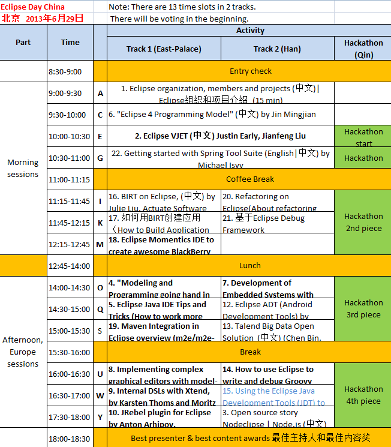

## Eclipse Day China

[Press-Release](press-release)	

[Call for support! 募集赞助！](call-for-support)

北京 2013年6月29日 （周六）full day 

<a href="http://wiki.eclipse.org/Eclipse_Day_China">official page Eclipse Day China</a>

The event is free, please register ASAP to reserve your seat. 此次活动免费，因席位有限，请务必尽早注册预留席位。

Registrations is closed. Limited number of guests (up to 10) can join remotely via WebEx. Contact organizers.
There is waiting list on http://democampbeijing2013.eventbrite.com/ 报名结束了。只有等着的列表。试试你的机会。

If you are coming from other city (not Beijing) or want to do demo or help around on Eclipse Day, please contact organizers.
 We need person who will lead Track 2 (come with notebook, connect with remote presenters, be whole day on the site).
 Speakers and co-organizers are always welcomed!

如果你要从另外的城市来，请联系我们能不能帮助你们。I you are coming from other city please contact us if we can help you. 

Register was on | 报名结束了。注册的在
	<ul>
		<li><a href="http://event.weibo.com/897258">微博活动网页/897258</a></li>
		<li><a href="http://democampbeijing2013.eventbrite.com">http://democampbeijing2013.eventbrite.com</a> 要报名 
		(Select 选择 register with email) </li>
		<li>或者在<a href="http://www.31huiyi.com/event/86173/">http://www.31huiyi.com/event/86173/</a>报名，都可以。</li>
	</ul>

### Organizers 组织者

   

  

欢迎欢迎一起组着这个活动

### Location 场地

[ThoughtWorks Beijing Office](/Day/Location/ThoughtWorksOffice)

### Date and Time 时间

[http://time.is/compare/0900_29_June_2013_in_Beijing/CET/London/New_York](http://time.is/compare/0900_29_June_2013_in_Beijing/CET/London/New_York)

### Agenda 议程

<a href="/hackathon/hackathon_beijing_2013.html">Eclipse编程马拉松活动（Eclipse Hackathon）</a>

[Topics voting 主题投票](topics-voting)

See official agenda at [wiki.eclipse.org/Eclipse_Day_China#Topics_and_Speakers](http://wiki.eclipse.org/Eclipse_Day_China#Topics_and_Speakers)

Lucky draw prize  (for those registered before June 18th)
is provided by BlackBerry company 

See also [speakers](Speakers/).

### Presentations materials 演示资料

[Are now on separate page 现在在这里](materials)

### In media 媒体

- [Eclipse Day China——面向中国开发人员和Eclipse爱好者的免费活动](http://user.qzone.qq.com/1521656858/blog/1370401338)	
- [安讯将于6月底分享开源BIRT相关知识](http://www.jifang360.com/news/2013617/n409649290.html)
- [BIRT Exchange Forum > Community Blog> Community BIRT> Eclipse Day China](http://www.birt-exchange.org/org/forum/index.php/blog/6/entry-492-eclipse-day-china/)
- [Warm up for Eclipse Day and Hackathon Beijing, 2013](http://jmj-eclipse.blogspot.com/2013/06/warm-up-for-eclipse-day-and-hackathon.html),
 read on [Planet Eclipse](http://planeteclipse.org/planet/)
- [what we have done last week (Eclipse Momentics | Cascades workshop)](http://ekkescorner.wordpress.com/2013/06/18/what-we-have-done-last-week-eclipse-momentics-cascades-workshop/)  

[big list of links](event-in-media)

### Entertainment 娱乐

- Possibly [mini-concert of "One Shot" band](https://www.dropbox.com/s/ysm39hi7b8k6af8/blue-suede-shoes-small.mov),
 we need guitar amplifier & drum set in ThoughtWorks office (contact organizer if you can help) 
- Karaoke 卡拉OK if you want (not organized) 我们没有组织
> Q: Do you know good karaoke club near-by that we can reserve (without deposit) and recommend to developers?

A: One is called [糖果](http://www.dianping.com/shop/513037), which locates in the north of Yonghegong bridge; 
Another is [钱柜](http://www.dianping.com/shop/2047324), on the south of Yonghegong bridge.  
Both are great :)

### Contacts 联系方式

Eclipse中国QQ群 321486747 

Paul Verest +86 187 01029146, [email](mailto:paul.verest@live.com?subject=Eclipse-Day-China&body=I_would_like_to_support_Eclipse_Day_China_event)
