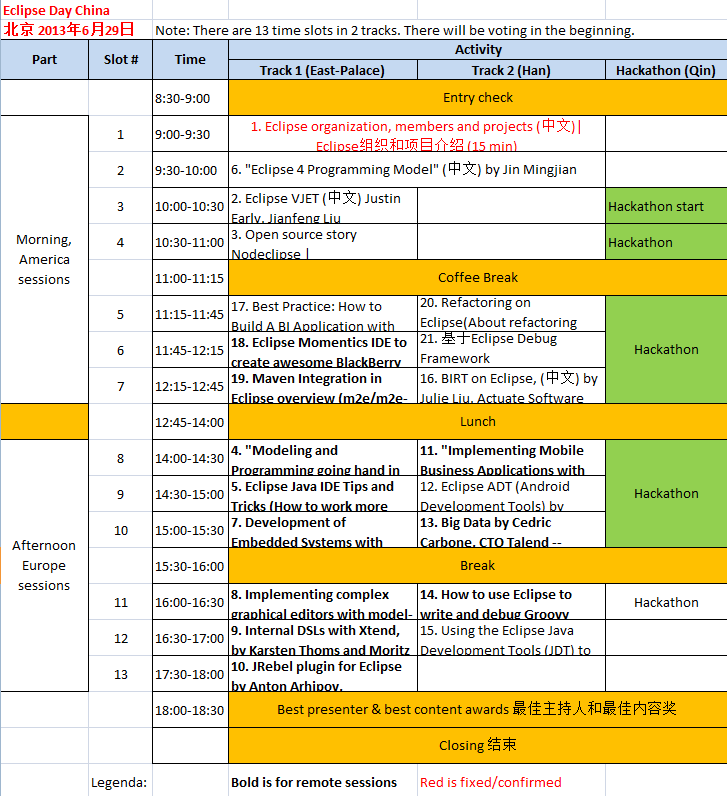

## Eclipse Day China

北京 2013年6月29日 （周六）full day 

<a href="http://wiki.eclipse.org/Eclipse_Day_China">official page Eclipse Day China</a>

<a href="hackathon/hackathon_beijing_2013.html">Eclipse编程马拉松活动（Eclipse Hackathon）</a>

### Organizers 组织者

### Location 场地

[ThoughtWorks Beijing Office](/Day/Location/ThoughtWorksOffice)

### Date and Time 时间

[http://time.is/compare/0900_29_June_2013_in_Beijing/CET/London/New_York](http://time.is/compare/0900_29_June_2013_in_Beijing/CET/London/New_York)

### Agenda

### Presentations materials

14) [.ppt How to use Eclipse to write and debug Groovy scripts on a live web application, Giampiero Granatella
 ManyDesigns](Presentations/Granatella/How to use Eclipse Day Beijing - Granatella.ppt) (It references 2 videos, not available here)

### In media

[Eclipse Day China——面向中国开发人员和Eclipse爱好者的免费活动](http://user.qzone.qq.com/1521656858/blog/1370401338)	
	
[press-release](press-release)	