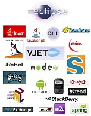
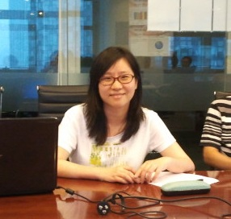

<b>Back to <a href="/Day/">Day page</a> | 回<a href="/Day/">Day网页</a></b>

[Kepler home](http://www.eclipse.org/kepler/), [help](//help.eclipse.org/kepler/)  
[Kepler Top 10 Highlights](http://www.eclipse.org/community/eclipse_newsletter/2013/june/article1.php)

See also [speakers](Speakers/).

## Eclipse Day China Materials 活动演示资料

如果在这里没有资料，是讲师还没分享的意思。

1. [Eclipse organization, members and projects (中文)| Eclipse组织和项目介绍](http://eclipse-china.github.io/Day/press-release)
2. [Eclipse VJET](Presentations/Liu_Jianfeng/VJET_EclipseCon.ppt) (中文) Jianfeng Liu
3. Open source story [Nodeclipse](http://www.nodeclipse.org/) | 在Eclipse开发Node.js (中文)
4. Modeling and Programming going hand in hand with [UML Lab](http://www.uml-lab.com/en/) - an Eclipse-based Modeling IDE by Manuel Bork, [Yatta Solutions](http://www.yatta.de/en/) [sfw](http://www.uml-lab.com/fileadmin/files/videos/roundtrip-940-en.flv)
5. [Eclipse Java IDE Tips and Tricks (How to work more effectively)](Presentations/Rabea_Gransberger/EclipseTippsAndTricks_NoNotes.pptx) by Rabea Gransberger
6. [Eclipse 4 Programming Model](Presentations/Jin_MingJian/Eclipse 4 Programming Model  and  Practices.pdf) (中文) by Jin Mingjian 
7. [Development of Embedded Systems with eTrice](Presentations/Thomas_Schuetz/20130629 eTrice - Eclipse Demo Camp Beijing.pptx) <http://www.eclipse.org/etrice/> by Thomas Schuetz, <http://www.protos.de>  
8. [Implementing complex graphical editors with model-driven technologies by Andreas Graf](Presentations/Andreas_Graf/Eclipse_DemoCamp_Beijing_2013.pdf) (中文&English), [screen-cast](Presentations/Andreas_Graf/GeneratedEditor.mp4)
9. Internal DSLs with Xtend, by Karsten Thoms, [itemis.com](http://www.itemis.com/)  
10. [JRebel plugin for Eclipse](Presentations/Anton_Arhipov/Eclipse Day China 2013 - JRebel for Eclipse2.pptx) by Anton Arhipov, <Zeroturnaround.com>
11. Implementing Mobile Business Applications with [Eclipse Scout](http://www.eclipse.org/scout/), by Matthias Zimmermann, [BSI Business Systems Integration AG](http://www.bsiag.com/en/home.html)
 [videos](http://eclipse-china.github.io/scout/video.html) 
12. Eclipse ADT (Android Development Tools) by 杨光福
13. [Talend](http://www.talend.com/) [Big Data Open Solution](Presentations/Liu_Wu/Talend Big Data Open Solution.pdf) (中文) (Chen Bin, Liu Wu)
14. [How to use Eclipse to write and debug Groovy scripts on a live web application](Presentations/Granatella/How to use Eclipse Day Beijing - Granatella.ppt), Giampiero Granatella [ManyDesigns](http://www.manydesigns.com/en/home)
 [Wizard-large.mov](Presentations/Granatella/Wizard-large.mov), [Eclipse Groovy-large.mov](Presentations/Granatella/Eclipse Groovy-large.mov) 
15. Using the Eclipse Java Development Tools (JDT) to analyze source code by Trent Hoeppner, IBM China
16. 基于Eclipse的BIRT （BIRT on Eclipse）, (中文) by 刘叶, Actuate Software China
17. 如何用BIRT创建应用 （How to Build Application on BIRT）, (中文) by 朱倩, Actuate Software China
18. Ekke's demo the new Eclipse Momentics IDE (BlackBerry): live hacking - no slides, but [big video](http://ge.tt/879UqUk/v/0) ([download](http://ge.tt/api/1/files/879UqUk/0/blob?download)). 
19. Working with Maven in Eclipse [html](Presentations/Fred_Bricon/m2e-eclipseday-beijing.html) | [pdf](Presentations/Fred_Bricon/m2e-eclipseday-beijing.pdf) by by Fred Bricon, Red Hat, Inc
20. Refactoring on Eclipse(About refactoring guidelines and demonstrate examples using Eclipse's refactoring tool), by 李彦辉, ThoughtWorks
21. [基于Eclipse Debug Framework 的流程编辑器调试功能的实现（Implementing debug functionality for process editor based on Eclipse Debug Framework）](Presentations/Sun_Juanchen/ImplementDebugFunctionalityUsingEclipseDebugFrameworks.pdf), by 孙镌宸, ThoughtWorks
22. Getting started with Spring Tool Suite (English|中文) by Michael Isvy, APJ Education Manager at Pivotal (SpringSource) was presented in person.

[Details | 详细信息](http://wiki.eclipse.org/Eclipse_Day_China#Details_.7C_.E8.AF.A6.E7.BB.86.E4.BF.A1.E6.81.AF) 

### Lucky Draw 幸运大抽奖

The lucky draw BlackBerry Q10 winner is Laura who gave also correct answer to BlackBerry Momentics IDE question by Ekke (topic 18).  

  

## Follow-ups 跟进

[Eclipse in browser demo](http://itsmdemo.siteview.com/itsmdemo/webloader) (actually using [Eclipse RAP](http://www.eclipse.org/rap/))
 by Chinese company [SiteView. 北京游龙网网络科技](http://www.siteview.com).
用[Eclipse RAP](http://www.eclipse.org/rap/)实现的[产品](http://itsmdemo.siteview.com/itsmdemo/webloader)。
