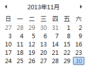

# Eclipse DemoDays

11月30日在北京，武汉，长沙，广州

  

<!-- 
http://huiyi.csdn.net/meeting
-->

Eclipse DemoDays 是免费的被Eclipse基金会支持的。
现在报名没有限制。人多的话可以选邀请谁。谁第一个报名谁有好处（那些早一点儿注册过，有偏好。）

Eclipse wiki 网页 <a href="http://wiki.eclipse.org/Eclipse_DemoCamps_November_2013">http://wiki.eclipse.org/Eclipse_DemoCamps_November_2013</a>

[Eclipse Day 中国 视频](http://www.funshion.com/uvideo/play/461974)。

[预期讲师（暂时）](speakers/)。每个城市讲师不一样，但是一部分是分享的。

现在找着期望大家可以帮助邀请有名的讲师。

还可以来介绍自己的项目。联系组织者。QQ 908781544。

## 北京

- 在北京11月14日还有[北京周四](http://wiki.eclipse.org/Eclipse_DemoCamps_November_2013/Beijing_Thursday)
 最多30个人，2个主题，交流
 [注册](https://yoopay.cn/event/77839001)

- [DemoDay 北京](http://wiki.eclipse.org/Eclipse_DemoCamps_November_2013/Beijing) 11月30日周六
 比较大的活动，10多主题
 [注册](https://yoopay.cn/event/76967677)

## 武汉

[DemoDay 武汉](http://wiki.eclipse.org/Eclipse_DemoCamps_November_2013/Wuhan) 是在
是在武汉市东湖新技术开发区光谷大道金融港A3栋。 是[北京风行在线技术有限公司](http://www.funshion.com/)组织者的

[注册](https://yoopay.cn/event/48715193)

## 长沙

[DemoDay 长沙](http://wiki.eclipse.org/Eclipse_DemoCamps_November_2013/Changsha)是在
长沙市天心区劳动西路308号凯华大厦B栋1202室, 游龙科技 (陈轩 QQ 178114976)

[注册](https://yoopay.cn/event/01780647)

## 广州

[DemoDay 广州](http://wiki.eclipse.org/Eclipse_DemoCamps_November_2013/Guangzhou)
是在广州市天河北路906号高科大厦A座22层 是[北京数字天堂信息科技有限责任公司广州分公司](http://www.d-heaven.com/)组织者的

[注册](https://yoopay.cn/event/14837678)
